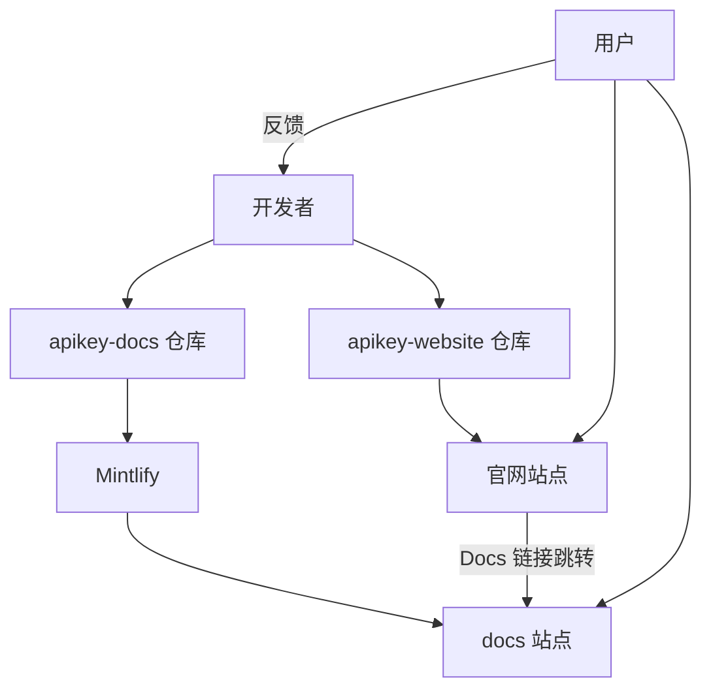

## 关系图

```mermaid
graph TD
    Dev[开发者]
    RepoDocs[apikey-docs 仓库]
    Mintlify[Mintlify]
    SiteDocs[docs 站点]
    RepoWeb[apikey-website 仓库]
    SiteWeb[官网站点]
    User[用户]

    Dev --> RepoDocs
    RepoDocs --> Mintlify
    Mintlify --> SiteDocs
    Dev --> RepoWeb
    RepoWeb --> SiteWeb
    SiteWeb -->|Docs 链接跳转| SiteDocs
    User --> SiteWeb
    User --> SiteDocs
    User -->|反馈| Dev
```

## 职责边界

- 官网仓库：产品介绍、下载入口、品牌页面
- 文档仓库：教程、CLI 指南、安全策略、FAQ
- 文档变更必须走 PR 审核，避免直接改主分支
