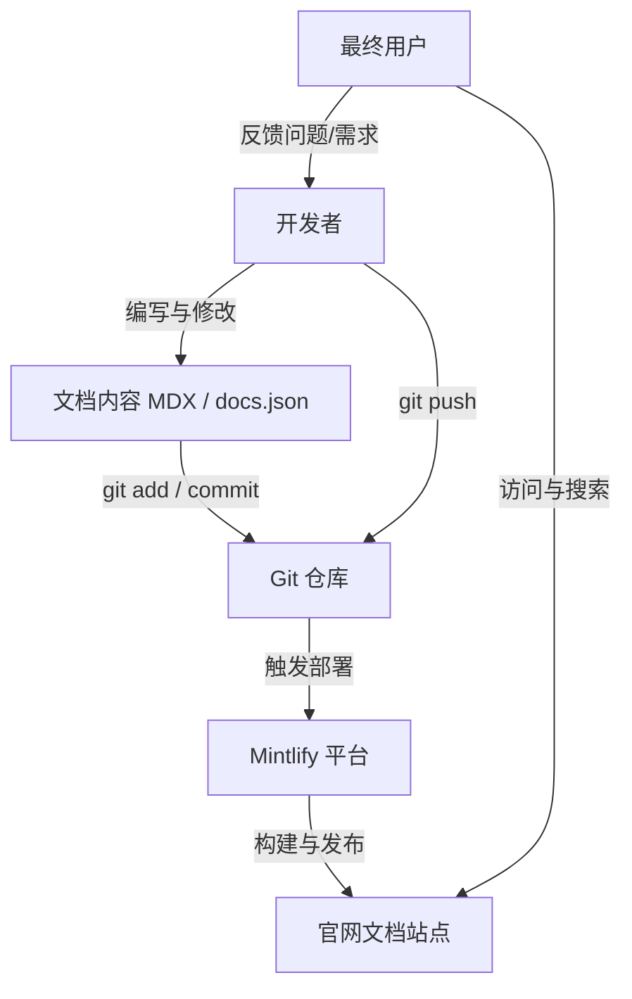

这篇文档帮你快速理解：一个文档站点从编写、预览到上线，核心角色之间是如何配合的。

## 核心关系图



## 每个角色负责什么

### 开发者（你）

- 负责写文档页面（`.mdx`）和站点配置（`docs.json`）
- 在本地通过 `mint dev` 预览效果
- 用 Git 提交并推送改动

### Git 仓库

- 保存每一次文档变更历史
- 作为部署触发源（通常推送到默认分支触发上线）

### Mintlify 平台

- 从仓库拉取最新内容
- 构建页面、处理导航与主题配置
- 自动发布到你的文档站点

### 官网文档站点

- 对外提供可访问的文档页面
- 承载搜索、导航、链接跳转等阅读体验

### 用户

- 阅读文档、根据文档使用产品
- 反馈不清楚或缺失的信息，反向推动文档迭代

## 实际使用流程（从改一行字到上线）


## 最小可用命令清单

```bash
# 1) 本地预览
mint dev

# 2) 提交改动
git add .
git commit -m "docs: update xxx"

# 3) 推送上线
git push
```

## 常见问题

- 推送失败（HTTPS 认证问题）：改用 SSH 远程地址
- `nothing to commit`：说明你还没有实际修改文件
- 本地预览报解析错误：检查 MDX 语法，必要时把非文档文件加入 `.mintignore`
