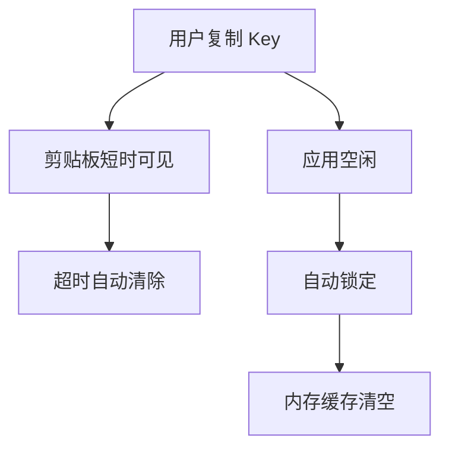

## 数据存储边界

- Key 值：存储在 macOS Keychain
- 元数据：本地数据库保存（用于检索、分类、展示）

## 安全机制

- 零上传：不依赖云端托管密钥
- 自动清除：剪贴板在设定时间后清空
- 自动锁定：空闲后自动锁定并清理内存缓存

## 风险模型

```mermaid
flowchart TD
    U[用户复制 Key] --> C[剪贴板短时可见]
    C --> T[超时自动清除]
    U --> L[应用空闲]
    L --> A[自动锁定]
    A --> M[内存缓存清空]
```
